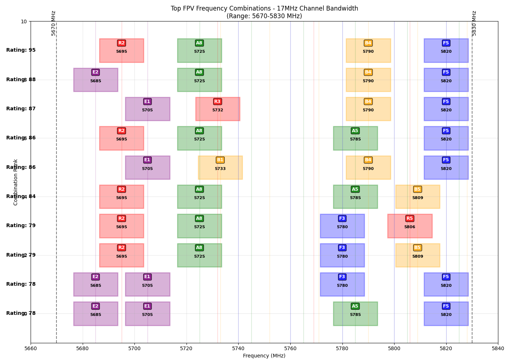

# IMD Avoider - FPV周波数最適化ツール

FPVドローンの複数機同時飛行時における相互変調歪み（IMD: Intermodulation Distortion）を最小化する周波数組み合わせを見つけるツールです。

## 最適化結果（アナログ/HDZero Narrow 17MHz）



### 上位10組の周波数組み合わせ

| Rank | 拡張評価 | レガシー評価 | Ch1 | Ch2 | Ch3 | Ch4 |
|------|----------|-------------|-----|-----|-----|-----|
| 1 | 97 | 95 | 5695(R2) | 5725(A8) | 5790(B4) | 5820(F5) |
| 2 | 95 | 88 | 5685(E2) | 5725(A8) | 5790(B4) | 5820(F5) |
| 3 | 95 | 86 | 5695(R2) | 5725(A8) | 5785(A5) | 5820(F5) |
| 4 | 95 | 87 | 5705(E1) | 5732(R3) | 5790(B4) | 5820(F5) |
| 5 | 94 | 84 | 5695(R2) | 5725(A8) | 5785(A5) | 5809(B5) |
| 6 | 94 | 86 | 5705(E1) | 5733(B1) | 5790(B4) | 5820(F5) |
| 7 | 92 | 77 | 5685(E2) | 5705(E1) | 5771(B3) | 5805(A4) |
| 8 | 92 | 76 | 5685(E2) | 5705(E1) | 5771(B3) | 5806(R5) |
| 9 | 92 | 78 | 5685(E2) | 5705(E1) | 5780(F3) | 5820(F5) |
| 10 | 92 | 78 | 5685(E2) | 5705(E1) | 5785(A5) | 5820(F5) |

※ 表記例: 5695(R2) = 5695 MHz, Raceband Channel 2

⚠️ **重要**: 拡張評価とレガシー評価の絶対値は直接比較できません。異なる計算方式のため、同じ組み合わせでも点数の意味が異なります。それぞれのシステム内での相対的な順位を参考にしてください。

## 概要

このツールは、5.8GHz帯のFPV周波数から4つのチャンネルを選択し、相互変調歪みが最小となる組み合わせを計算します。標準的なFPVバンド（Raceband、Fatshark、Boscam A/B、Band E）から選択可能です。

**新機能**: 学術研究に基づく拡張IMD計算により、実環境での干渉をより正確に予測します。2次IMDに加えて3次IMDも考慮し、信号強度に基づく重み付けを適用しています。

## 拡張評価とレガシー評価の違い

### レガシー評価（Legacy Rating）
- **計算方法**: 2次IMD（2×f1 - f2）のみを考慮
- **IMDの種類**: 1種類のみ
- **計算式**: `評価 = 100 - (2次干渉スコア) / (5 × n)`
- **特徴**: 
  - シンプルで計算が高速
  - 一部の重要な干渉パターンを見逃す可能性
  - 従来のIMDTablerツールと互換性あり

### 拡張評価（Enhanced Rating）
- **計算方法**: 2次IMDと3次IMDの両方を考慮
- **IMDの種類**: 
  - 2次IMD: 2×f1 - f2（重み: 1.0）
  - 3次IMD（2周波数）: 2×f2 - f1など（重み: 0.1 = -20dB）
  - 3次IMD（3周波数）: f1 + f2 - f3など（重み: 0.03 = -30dB）
- **計算式**: `評価 = 100 - (2次 + 3次加重干渉スコア) / (15 × n)`
- **特徴**:
  - 実際の干渉パターンをより正確に反映
  - 近接チャンネル干渉を検出
  - 学術研究に基づいた科学的な重み付け

### なぜ両方を表示するのか？
1. **比較のため**: 改善度を確認できる（ただし絶対値の比較は不可）
2. **後方互換性**: 従来のツールを使用していたユーザーの参考のため
3. **検証**: 新しい計算方法の妥当性を確認するため

⚠️ **重要**: 計算方法が異なるため、拡張評価97点とレガシー評価95点を比較して「2点改善」と考えるのは誤りです。それぞれのシステム内での相対的な順位を参考にしてください。

## 特徴

- **複数の帯域幅モードに対応**
  - `analog`: 従来のアナログFPV (17 MHz)
  - `hdzero-narrow`: HDZeroナローモード (17 MHz)
  - `hdzero`: HDZero標準モード (27 MHz)
  - `dji`: DJIデジタルFPV (20 MHz)

- **周波数範囲**: 5670-5830 MHz内で使用可能な周波数を自動フィルタリング
- **拡張IMD評価**: 2次・3次相互変調を包括的に計算し、0-100のスコアで評価（高いほど良い）
- **視覚化**: 上位10組の結果をグラフで表示、最良の組み合わせのIMD製品も可視化
- **詳細分析**: 各組み合わせの干渉源を特定し、最悪ケースを表示
- **レガシー比較**: 従来の評価方式との比較により改善度を確認可能

## インストール

### uvを使用する場合（推奨）
```bash
# 依存関係のインストール
uv sync

# アプリケーションの実行
uv run python app.py [モード]
```

### pipを使用する場合
```bash
pip install matplotlib
python3 app.py [モード]
```

## 使用方法

```bash
# デフォルト（17 MHz アナログ/HDZeroナロー）
uv run python app.py

# HDZero標準モード（27 MHz）
uv run python app.py hdzero

# HDZeroナローモード（17 MHz）
uv run python app.py hdzero-narrow

# 従来のアナログ（17 MHz）
uv run python app.py analog

# DJIデジタル（20 MHz）
uv run python app.py dji
```

## 実行結果の例

```
Using analog mode with 17 MHz bandwidth
Total FPV frequencies: 39
Frequencies that fit entirely in range 5670-5830 MHz: 21
Available frequencies: [5685, 5695, 5705, 5725, 5732, 5733, 5740, 5745, 5752, 5760, 5765, 5769, 5771, 5780, 5785, 5790, 5800, 5805, 5806, 5809, 5820]
Channel edges: 5678.5 to 5821.5 MHz
Total combinations: 1126

Top 10 FPV frequency combinations (Enhanced IMD Analysis):
1. Rating: 97 (Legacy: 95) - 5695MHz(R2), 5725MHz(A8), 5790MHz(B4), 5820MHz(F5)
2. Rating: 95 (Legacy: 88) - 5685MHz(E2), 5725MHz(A8), 5790MHz(B4), 5820MHz(F5)
3. Rating: 95 (Legacy: 86) - 5695MHz(R2), 5725MHz(A8), 5785MHz(A5), 5820MHz(F5)
4. Rating: 95 (Legacy: 87) - 5705MHz(E1), 5732MHz(R3), 5790MHz(B4), 5820MHz(F5)
5. Rating: 94 (Legacy: 84) - 5695MHz(R2), 5725MHz(A8), 5785MHz(A5), 5809MHz(B5)
6. Rating: 94 (Legacy: 86) - 5705MHz(E1), 5733MHz(B1), 5790MHz(B4), 5820MHz(F5)
7. Rating: 92 (Legacy: 77) - 5685MHz(E2), 5705MHz(E1), 5771MHz(B3), 5805MHz(A4)
8. Rating: 92 (Legacy: 76) - 5685MHz(E2), 5705MHz(E1), 5771MHz(B3), 5806MHz(R5)
9. Rating: 92 (Legacy: 78) - 5685MHz(E2), 5705MHz(E1), 5780MHz(F3), 5820MHz(F5)
10. Rating: 92 (Legacy: 78) - 5685MHz(E2), 5705MHz(E1), 5785MHz(A5), 5820MHz(F5)

================================================================================
Rank | Rating | Ch1        | Ch2        | Ch3        | Ch4        
--------------------------------------------------------------------------------
   1 |     95 | 5695(R2)   | 5725(A8)   | 5790(B4)   | 5820(F5)  
   2 |     88 | 5685(E2)   | 5725(A8)   | 5790(B4)   | 5820(F5)  
   3 |     87 | 5705(E1)   | 5732(R3)   | 5790(B4)   | 5820(F5)  
   4 |     86 | 5695(R2)   | 5725(A8)   | 5785(A5)   | 5820(F5)  
   5 |     86 | 5705(E1)   | 5733(B1)   | 5790(B4)   | 5820(F5)  
   6 |     84 | 5695(R2)   | 5725(A8)   | 5785(A5)   | 5809(B5)  
   7 |     79 | 5695(R2)   | 5725(A8)   | 5780(F3)   | 5806(R5)  
   8 |     79 | 5695(R2)   | 5725(A8)   | 5780(F3)   | 5809(B5)  
   9 |     92 | 5685(E2)   | 5705(E1)   | 5780(F3)   | 5820(F5)  
  10 |     92 | 5685(E2)   | 5705(E1)   | 5785(A5)   | 5820(F5)  
================================================================================

Detailed IMD Analysis for Best Combination:
Frequencies: [5695, 5725, 5790, 5820]
Enhanced Rating: 97, Legacy Rating: 95

Significant IMD products:
  2nd order: 4
  3rd order (2-freq): 0
  3rd order (3-freq): 4

Worst 5 interference cases:
  2×5695 - 5725 = 5665 MHz
    Type: 2Nd Order
    Separation: 30 MHz, Score: 25.00
  ...
```

## 結果の見方

- **拡張評価**: 2次・3次IMDを包括的に考慮した評価（0-100、高いほど干渉が少ない）
- **レガシー評価**: 2次IMDのみの従来評価（参考値）
- **周波数表記**: `5695MHz(R2)` = 5695 MHz（Raceband チャンネル2）
- **グラフ**: 各チャンネルの帯域幅と周波数配置を視覚的に表示

### 評価スコアの解釈

#### 拡張評価の目安
- **90以上**: 優秀（レース環境で推奨）
- **80-90**: 良好（一般的な飛行で問題なし）
- **70-80**: 要注意（環境により干渉の可能性）
- **70未満**: 非推奨（干渉リスクが高い）

⚠️ **注意**: 拡張評価とレガシー評価は計算方法が異なるため、絶対値の比較はできません。例えば「拡張97点 vs レガシー95点」を「2点改善」と解釈するのは誤りです。重要なのは各評価システム内での相対的な順位です。

## 技術仕様

### 拡張IMD評価アルゴリズム

本ツールは、従来の2次IMDに加えて3次IMDも考慮した拡張アルゴリズムを採用しています：

- **2次IMD**: 2×f1 - f2（従来方式、重み1.0）
- **3次IMD（2周波数）**: 2×f2 - f1など（重み0.1 = -20dB）
- **3次IMD（3周波数）**: f1 + f2 - f3など（重み0.03 = -30dB）

詳細な研究背景については [IMD研究文書](IMD_Research_Document_JP.md) を参照してください。

### パラメータ
- **有効周波数範囲**: 5100-6099 MHz（imd.pyで定義）
- **最小チャンネル間隔**: チャンネル帯域幅 + 1 MHz
- **しきい値**: 2次IMD用35MHz、3次IMD用25MHz

## ライセンス

このプロジェクトはオープンソースです。